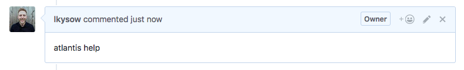

Atlantis integrate directly on the `pull request`, we can run commands in pull request comments.

Atlantis triggers commands via pull request comments.


### Atlantis Help

```bash
atlantis help
```

View help

### Atlantis Version

```bash
atlantis version
```

Print the output of 'terraform version'.

### Atlantis Plan

```bash
atlantis plan [options] -- [terraform plan flags]
```

Runs terraform plan on the pull request's branch.
You may wish to re-run plan after Atlantis has already done so if you've changed some resources manually.

#### Runs plan in the root directory of the repo with workspace `default`

```bash
atlantis plan -d .
```

#### Runs plan in the `project1` directory of the repo with workspace `default`

```bash
atlantis plan -p project1
```

#### Runs plan in the root directory of the repo with workspace `staging`

```bash
atlantis plan -w staging
```

## Options

- d `directory`: Which directory to run plan in relative to root of repo. Use . for root.
Ex. atlantis plan -d child/dir

-p `project`: Which project to run plan for. Refers to the name of the project configured in the repo's atlantis.yaml file. Cannot be used at same time as `-d` or `-w` because the project defines this already.

-w `workspace`: Switch to this Terraform workspace before planning. Defaults to default. Ignore this if Terraform workspaces are unused.

- `--verbose`: Append Atlantis log to comment.

### Note:

- A `atlantis plan` (***without flags***), like autoplans, discards all plans previously created with atlantis plan -p/ -d/ -w.

## Additional Terraform flags

If terraform plan requires additional arguments, like -target=resource or -var 'foo=bar' or -var-file myfile.tfvars you can append them to the end of the comment after --

```bash
atlantis plan -d dir -- -var foo='bar'
```

## Using the -destroy Flag

To perform a destructive plan that will destroy resources you can use the -destroy flag like this:

```bash
atlantis plan -- -destroy
```

or

```bash
atlantis plan -d dir -- -destroy
```
### Note:

The `-destroy` flag generates a destroy plan, If this plan is applied it can result in data loss or service disruptions. Ensure that you have thoroughly reviewed your Terraform configuration and intend to remove the specified resources before using this flag.

## atlantis apply

```bash
atlantis apply [options] -- [terraform apply flags]
```
Runs terraform apply for the plan that matches the directory/project/workspace.

### TIP

If no directory/project/workspace is specified, ex. atlantis apply, this command will apply all unapplied plans from this pull request.

This includes all projects that have been planned manually with atlantis plan -p/-d/-w since the last autoplan or atlantis plan command.

For Atlantis commands to work, Atlantis needs to know the location where the plan file is. For that, you can use $PLANFILE which will contain the path of the plan file to be used in your custom steps. i.e terraform plan -out $PLANFILE.

#### Runs apply for all unapplied plans from this pull request.

```bash
atlantis apply
```

#### Runs apply in the root directory of the repo with workspace `default`.

```bash
atlantis apply -d .
```

#### Runs apply in the `project1` directory of the repo with workspace `default`

```bash
atlantis apply -p project1
```

#### Runs apply in the root directory of the repo with workspace `staging`

```bash
atlantis apply -w staging
```

### Options

- -d `directory`: Apply the plan for this directory, relative to root of repo. Use . for root.

- -p `project`: Apply the plan for this project. Refers to the name of the project configured in the repo's atlantis.yaml file. Cannot be used at same time as -d or -w.

- -w `workspace`: Apply the plan for this Terraform workspace. Ignore this if Terraform workspaces are unused.

- `--auto-merge-disabled`: Disable automerge for this apply command.

- `--verbose`: Append Atlantis log to comment.

### Because Atlantis under the hood is running terraform apply plan.tfplan, any Terraform options that would change the plan are ignored, ex:

- -target=resource
- -var 'foo=bar'
- -var-file=myfile.tfvars

They're ignored because they can't be specified for an already generated planfile. If you would like to specify these flags, do it while running atlantis plan.
